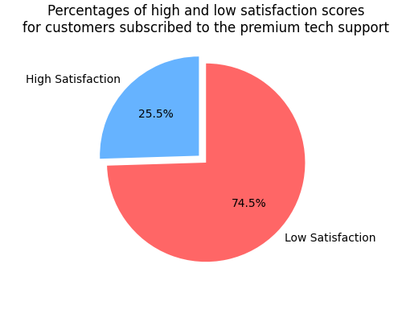

# Telco customer churn analytics and model 📊

This project is one in which I have analyzed and answered questions about the **Telco customer churn** dataset and have built a machine learnning model for predicting the churn label according to some information about the customers

## Goal 🎯
The goal of this project is to understand churn and service usage patterns among customers and also find a solution to estimate whether a customer might or might not choose to churn

## Technologies 🛠️
- **Python**
- **pandas**
- **matplotlib**
- **seaborn**
- **scikit-learn**
- **Gradient Boosting Classifier** (for classification)

## Folder Structure 📁
```
/project-root
│
├── /.venv                 # The virtual environement with all required packages and dependencies
├── /analytics             # Analytics notebooks
├── /data                  # Dataset, raw and preprocessed
├── /model                 # Saved model with X_test and y_test data
├── /notebooks             # Jupyter notebooks for preprocessing, and evaluation
├── /src                   # Source code for loading data and training
├── /Visualization         # All visualizations gathered from analytics
├── requirements.txt       # Python dependencies
└── README.md              # This README file
```

## Installation 📦
1. Clone this repository:
   ```bash
   git clone https://github.com/Amira-Bekhta/telco_customer_churn
   ```

2. Install the required libraries:
   ```bash
   pip install -r requirements.txt
   ```

## Highlights ⚗️
- **Most premium tech support subcribers have a low satisfaction score:** <br>

- **Most Telco customers download 15 to 30 GB monthly and pay 78 to 98 dollars** <br>


## Model 🧠
- **Classifier**: Gradient Boosting Classifier
- **Accuracy Score**: 0.84 

## Dataset 📊
This project uses the [Telco customer churn dataset](https://www.kaggle.com/datasets/alfathterry/telco-customer-churn-11-1-3)
